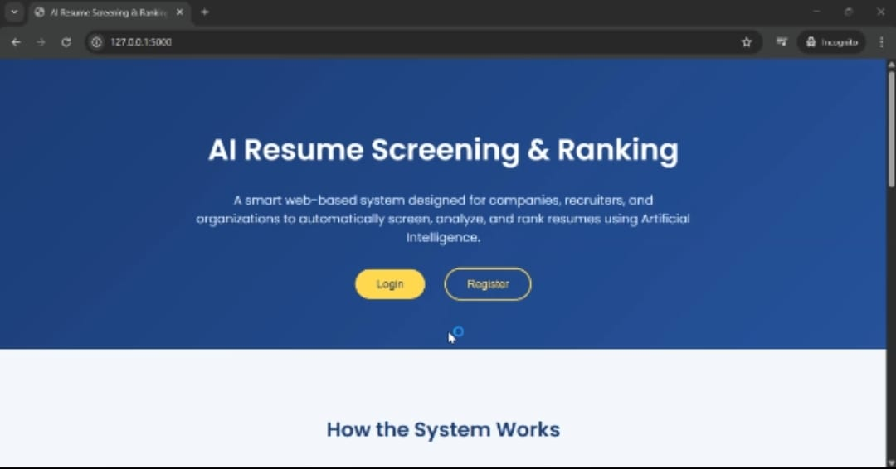

## 🤖 AI Resume Screening & Ranking System
An AI-powered web application that automatically screens, scores, and ranks resumes based on a given job description.
Built using Flask, Machine Learning, and Natural Language Processing (NLP), this system helps recruiters and hiring teams significantly reduce manual resume shortlisting time.

## 🧠 Project Overview
In real-world hiring, recruiters often receive hundreds of resumes for a single role.
Manually reviewing them is time-consuming and error-prone.
This system automates the screening process by:
Extracting resume content from PDF and DOCX files
Preprocessing text using NLP techniques
Ranking resumes using TF-IDF vectorization and cosine similarity
The result is a ranked list of candidates based on how well their resumes match the job description.

## ⚙️ Tech Stack
Layer	        Technology
Frontend	    HTML5, CSS3, JavaScript
Backend	        Flask (Python)
Database	    SQLite
AI / NLP	    Scikit-learn, NLTK
Resume Parsing	pdfplumber, python-docx
Security	    Werkzeug password hashing

## ✨ Key Features
# 🧾 Multi-Resume Upload
Upload multiple resumes at once (PDF / DOCX)
Automatic text extraction and preprocessing
# 🧠 AI-Based Resume Ranking
Uses TF-IDF + Cosine Similarity
Ranks resumes based on relevance to the job description
Displays clear similarity scores for transparency
# 🧩 Job Description Validator
Checks whether a job description contains:
Role clarity
Skills
Experience requirements
Provides quality feedback and improvement suggestions
# 📊 Dashboard
Stores and displays previous screening results
Allows users to delete ranking history easily
# 🔐 Authentication System
User registration and login
Forgot password functionality (AJAX-based)
Secure password hashing using Werkzeug
# 🎨 Clean & Responsive UI
Simple, modern interface
Consistent design across all pages
Works well on different screen sizes

## 📁 Project Structure
AI_resume_screening_and_ranking/
│
├── app.py                  # Main Flask application
├── ranking.py              # Resume ranking logic
├── text_processing.py      # Resume parsing & NLP processing
├── init_db.py                # User authentication logic
├── requirements.txt        # Project dependencies
├── users.db                # SQLite database (auto-generated)
│
├── templates/              # HTML templates
│   ├── index.html
│   ├── login.html
│   ├── register.html
│   ├── uploads.html
│   ├── rank.html
│   ├── results.html
│   ├── dashboard.html
│   └── forgotpassword.html
│
└── screenshots/              # Uploaded resume files
│   ├── Dashboard.jpeg
│   ├── JobDescription.jpeg
│   ├── LandingPage.jpeg
│   ├── Login.jpeg
│   ├── register.jpeg
│   ├── Results.jpeg
│   ├── Upload.jpeg
|___

## 🚀 How It Works
User logs in or registers
Uploads multiple resumes
Enters a job description
System:
Extracts resume text
Preprocesses data using NLP
Computes similarity scores
Ranked resumes are displayed on the results page
Results are saved for future reference

## 🔮 Future Improvements
Advanced semantic matching using transformer-based models
Resume keyword highlighting
Export results to CSV / Excel
Role-based access (Recruiter / Admin)
Email-based password reset system

## ⚖️ License
This project is licensed under the MIT License.
You are free to use, modify, and distribute this project for learning, research, and innovation.
⚡ Powered by AI — built to simplify resume screening.

## 📷 Screenshots
## Landing Page

## Resume Upload

## Ranking Results

## Dashboard

## 🎥 Demo Video
▶️ [Watch Demo Video] (https://drive.google.com/file/d/1AI-rWQOc8Ajaj5EZq-oAcD9rqI4Fsmt-/view?usp=drivesdk)